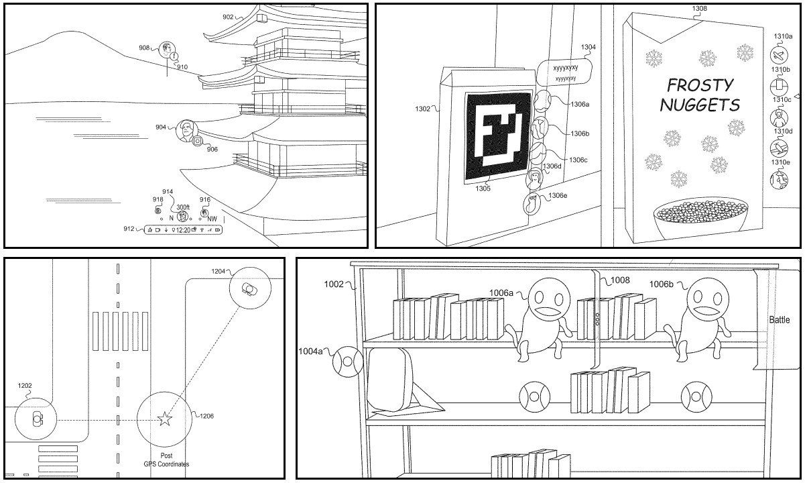

# What I Can Say Under NDA

The AR glasses team at Meta began with a small group of designers and prototypers. Their goal was to understand the core value propositions of the [Meta’s unreleased AR glasses](https://www.theverge.com/2018/10/25/18022142/facebook-ar-glasses-augmented-reality) given the hardware considerations and constraints of a smaller form factor. Through user experience research (UXR) and prototyping with early hardware, the team honed in on what could make glasses-based AR compelling. As the team grew, they helped flush out the experiences that had been defined.

I had three roles on the team at this stage. First, I designed and prototyped the **core UX of the spatial OS, including the system launcher**. This involved building large end-to-end prototypes while collaborating with the inputs team's ever-evolving interaction model. Second, I helped define how experiences fit into this core UX by **helping to define the app model**. This included defining roles for manipulation and placement, how apps interact, and what signifiers and affordances apps consist of. Third, this was all while **supporting hardware teams** in mitigating and understanding the constraints for the brand-new hardware — display, compute, input, etc.

<!-- patent iamge -->

Although most of this work is under NDA, you can see the beginnings of it through our [mixed reality patent filings](https://patents.google.com/patent/US20220157027A1/en?oq=US2022157027A1), and the [Spark Virtual Objects Beta from Connect 2022](https://sparkar.facebook.com/blog/meta-connect-2022-roundup/).

<!-- spark virtual object -->

I’ll leave you with a short glimpse of how people will connect to the augmented layer of the metaverse and our new app model from our Meta announcement.

<iframe width="900" height="506" src="https://www.youtube.com/embed/Uvufun6xer8?start=3632" title="YouTube video player" frameborder="0" allow="accelerometer; autoplay; clipboard-write; encrypted-media; gyroscope; picture-in-picture; web-share" allowfullscreen></iframe>
