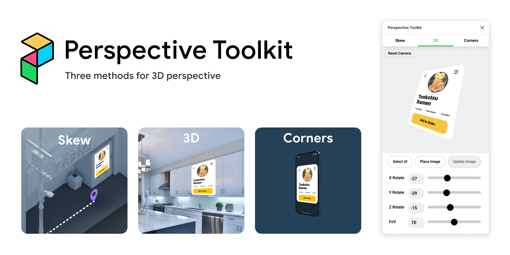

<a class="topLink" href="https://www.figma.com/community/plugin/862059663689780943/Perspective-Toolkit">
  <button class="secondary center" data="Try It in Figma"></button></a>
</a> 

# Bringing It Into Perspective

Early on while designing for AR/VR I noticed a frustrating inefficiency of the design process. Early ideation went smoothly, and high-fidelity prototypes were a great way to get strong feedback on, but they took months of work. There was still a disconnect in the middle where we could have aligned without fully building a prototype. 

<!--  -->

The problem was, bringing folks along with 3D design wasn’t as easy as we had hoped. Existing tools like Blender and Unity were high fidelity but painfully slow for early iteration. Figma was still the winner to get ideas out quickly to align on what prototypes were built. 

<video height="666" width="1280" autoplay="true" loop="true" playsinline="true" muted>
    <source src="../static/img/PToolkit.webm" type="video/webm">
    <source src="../static/img/PToolkit.mp4" type="video/mp4">
    <source src="../static/img/PToolkit.mov" type="video/mov">
    
Your browser does not support embedded videos

</video>

# The Plugin
Perspective Toolkit was created with this in mind; it allowed the quick iteration of 2D design tools while allowing closer-to-reality 3D mocks directly inside Figma. Saving valuable time instead of jumping into Photoshop, or across multiple plugins, many of which were against company policy.

The three methods were chosen by observing other designers build 3D elements. **Isometric skewing** is great for top-down diagrams, **3D perspective** is excellent for getting UI into photos and virtual environments, and the **corners** method gives the flexibility to break the real perspective constraints. 

# The Future
Since we needed full perspective 3D, I built this tool on top of Three.js to allow the flexibility that a 3D engine offered; paving way for future 3D features an engine offers. Originally designed as an internal Meta plugin, Perspective toolkit has now launched publicly, and has garnered over **50k+ uses** as of writing this.
